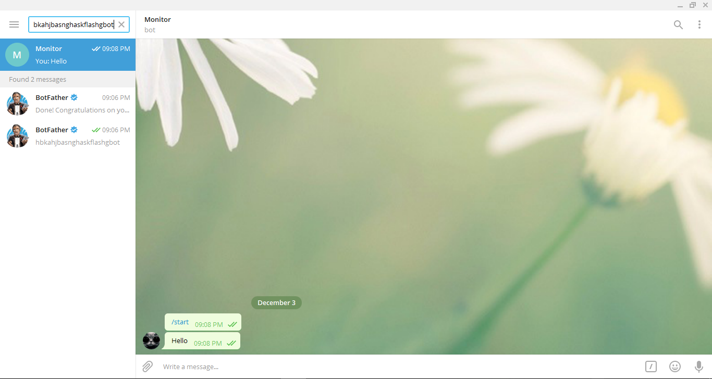

# I. Cảnh báo qua Email
 * Vào setting -> Mail/DNS. Tùy từng mail cần gửi đến khác nhau chỉnh các tham số như trong hình. Sau đó chọn Send a Test mail để test.

 * Nếu ra như trong hình sau là được

.PNG))

 * Vào setting chọn Thresholds -> Add

.PNG)

 * Chọn các lựa chọn như trong hình -> Create

.PNG)

.PNG)

 * Chọn theo hình cảnh báo khi lương lượng trên 50 và dưới 100 => Save

.PNG)
 * Check mail khi có cảnh báo:

.PNG)

# II. Cảnh báo qua Telegram

### Sử dụng plugin CereusTransporte để xuất dữ liệu từ cacti thu thập được từ file .rrd trong thư mục rra sang influxdb. Sau đó sử dụng Grafana để hiển thị dữ liệu từ influxdb và gửi cảnh báo về Telegram.

## 1. Tạo bot trên Telegram

- Tải, cài đặt và đăng ký tài khoản trên ứng dụng nhắn tin Telegram
- Mở ứng dụng vào Search tìm kiểm "@BotFather" và Start để làm việc với BotFather 

- Bắt đầu tạo bot bằng lệnh /newbot sau đó đặt tên và đặt username cho bot. Sau đó BotFather sẽ cho một Token của bot, ở trong hình Token là: 485183556:AAED64Qp5qx9bYrF9gHQCgIMMHI94yZ6mpc.

- Tìm kiếm username của bot vừa tạo trên thanh Search, trong hình username bot là: hbkahjbasnghaskflashgbot, và gõ một message bất kỳ đến bot.

- Vào trình duyệt nhập: https://api.telegram.org/bot<token>/getUpdates. Với Token mà BotFather đã cho trước. Sau đó nhận được nội dung hiển thị sau để lấy chatID. Ở đây chatID là: 44627988.

- Gửi thử message đến bot bằng trình duyệt: https://api.telegram.org/bot<Token>/sendMessage?chat_id=<....>&text=test. Với Token và ChatID đã có ở trên. Message "test" đã gửi được về bot.

- Sau đó vào Telegram tạo một channel và add Bot vừa tạo làm Administrator để khi có message gửi về Bot sẽ cũng được hiện trên Channel và có thể add thêm các user khác vào Channel đó. 

## 2. Cài đặt và cấu hình

- Cài đặt plugin CereusTransporte

		wget https://www.urban-software.com/?ddownload=2770
		unzip CereusTransporter_v0.64-2
		cp -r CereusTransporter /var/www/html/cacti/plugins/

- Cài đăt influxdb

		wget https://dl.influxdata.com/influxdb/releasesinfluxdb-1.3.2.x86_64.rpm
		yum install influxdb-1.3.2.x86_64.rpm -y
		chkconfig influxdb on
		service influxdb start
- Tạo database và user trên influxdb
		
		influxdb
		CREATE DATABASE cacti;
		CREATE USER "influx" WITH PASSWORD 'influx_pass' WITH ALL PRIVILEGES;
		exit;
		
- Cài đặt Grafana

		yum install -y https://s3-us-west-2.amazonaws.com/grafana-releases/release/grafana-4.4.2-1.x86_64.rpm
		chkconfig grafana-server on
		service grafana-server start 

- Vào http://172.16.20.10/Cacti => Plugin Management => Kích hoạt plugin CereusTransporte
	
 

- Tiếp vào Setting => Misc. Chọn theo trong hình với dbname: cacti, user: influx, password: influx_pass.
 

- Vào http://172.16.20.10:3000 => Create your frist database source => Cấu hình như trong hình

 
 

- Home Grafana => Alerting => Notification Channels => New Channel => Nhập các thông số yêu cầu và thử bằng bấm Send Test để gửi và lưu lại bằng Save.
 

- Quay lại trang chủ Grafana => Create your frist databoard => Graph => Panel Title => Edit. Xong thay đổi tham số như trong hình: Trong hình là ví dụ monitor Pfsense em1
 

- Chuyển sang Tab Alert để cài cảnh báo: Trong ví dụ đặt cảnh báo trên 6 Mbps sẽ cảnh báo.
 

- Thông tin cảnh báo gửi về Telegram:

