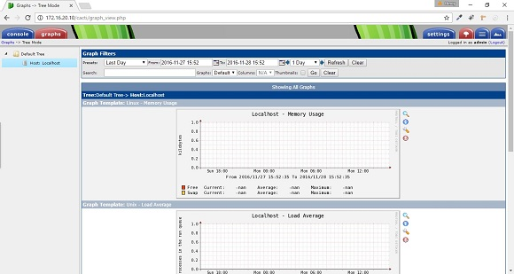

## Cấu hình Cacti

 * Truy cập địa chỉ http://172.16.20.10 để tiến hành cài đặt -> Next

 * Kiểm tra xem có lỗi package nào không, nếu không thì bấm next.

 * Login bằng tài khoản mặc định: user: admin password: admin

 * Đổi password cho tài khoản addmin lần đầu đăng nhập

 * Giao diện cacti

 * Chuyển qua Tab Graph thấy lỗi hiển thị

 * Để khắc phục lỗi hiển thị đồ thị, cần cấu hình Cacti cứ 5 phút sẽ thu thập thông tin và lưu trong rrd files. Lúc này tab Graph sẽ hiên thị đồ thị dựa trên những thông tin thu được từ file rrd trong thư mục /var/www/html/cacti/rra/. Bây giờ tiến hành cấu hình với user cacti từ Centos Server
			
			[root@centos6 ~]# useradd cacti
			[root@centos6 ~]# passwd cacti

 * Tạo crontab cho account cacti sẽ thu thập dữ liệu 5 phút 1 lần và đẩy dư liệu về thư mục "/var/www/html/cacti/rra"

			crontab -u cacti -e
			*/5 * * * * /usr/bin/php /var/www/html/cacti/poller.php
 + Change permission cho thư mục "/var/www/html/cacti/rra" và log file

			chown cacti /var/www/html/cacti/rra
			chown cacti /var/www/html/cacti/log/cacti.log
 + Chỉnh lại timezone trong file php.ini 

			vim /etc/php.ini
			/* change timezone to "Asia/Ho_Chi_Minh" */
			date.timezone = "Asia/Ho_Chi_Minh"
 + Khởi động lại service apache và khởi tạo dữ liệu thu thập lần đầu bằng account cacti

			service httpd restart 
			su - cacti 
			/usr/bin/php /var/www/html/cacti/poller.php
 + Truy cập lại địa chỉ http://172.16.20.10/cacti/graph_view.php để kiểm tra 

Như vậy xong phần cấu hình