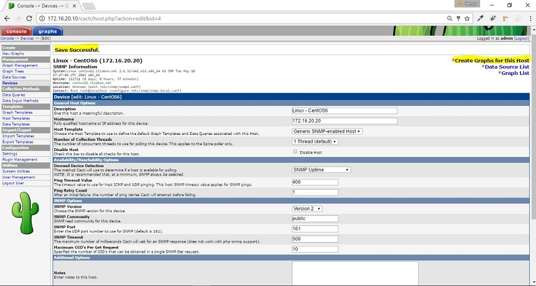

# Monitor Linux server
  

 * Giám sát Linux Server bằng SNMP ( IP 172.16.20.20 ) 

 * Cài đặt và cấu hình SNMP trên Linux Server CentOS ( IP: 172.16.20.20 ) cần theo dõi

			yum -y install net-snmp-utils net-snmp
 + Cấu hình SNMP string community trong file /etc/snmp/snmpd.conf

			cp /etc/snmp/snmpd.conf /etc/snmp/snmpd.conf.org
			vim /etc/snmp/snmpd.conf
			/* thêm string community snmp */
			rocommunity public
 + Khởi động SNMP service 

			chkconfig snmpd on 
			service snmpd start 
 + Thêm thiết bị cần theo dõi vào Cacti site : Chọn Device -> Add 

+ Tạo đồ thị trên Linux Server vừa thêm -> chọn " Create Graphs for this Host "
 

+ Tạo Graph Templates muốn theo dõi như "network interface - eth0, Memory, Load ..." . Chọn và click "Create"

+ Vào mục "Graph Trees" để tạo Graph Trees mới. "Name: Linux Servers" -> chọn "Create"

+ Thêm CentOS6 vào "Graph Trees" Linux Server vừa tạo . Chọn Graph Trees -> Linux Servers . Trong mục Tree Items chọn  Add 

+ Kiểm tra hiển thị dữ liệu trên đồ thị. Chọn " graphs -> Linux Servers -> Host: Linux - CentOS6 "

